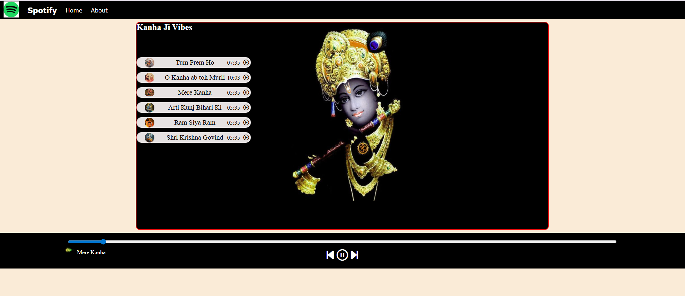

# 🎵 Spotify Clone

A responsive and visually appealing Spotify clone that allows users to explore music, view playlists, and enjoy a modern, interactive UI inspired by the real Spotify platform.

🔗 **Live Demo:** [https://mahak-shar.github.io/spotify_clone/](https://mahak-shar.github.io/spotify_clone/)  
📁 **GitHub Repository:** [https://github.com/mahak-shar/spotify_clone](https://github.com/mahak-shar/spotify_clone)

---

## 📸 Preview

---

## 🚀 Features

- 🎧 Music UI inspired by Spotify
- 📱 Responsive design across devices
- 🟢 Clean layout with green and black Spotify theme
- 🔍 Hover effects, clickable buttons, and album visuals
- ⚡ Built using modern frontend stack

---

## 🛠️ Tech Stack

- **HTML5**
- **CSS3**
- **JavaScript**
- **Responsive Web Design**
- **GitHub Pages** (for deployment)

---

## 📁 Folder Structure

spotify_clone/
├── assets/ # Images, icons, and static assets
├── css/ # Styling files
├── index.html # Main HTML page
├── script.js # JavaScript logic
├── preview.png # Project screenshot
└── README.md # Project documentation

